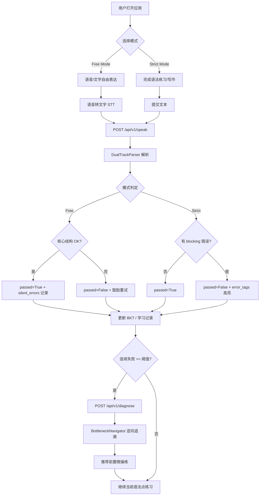
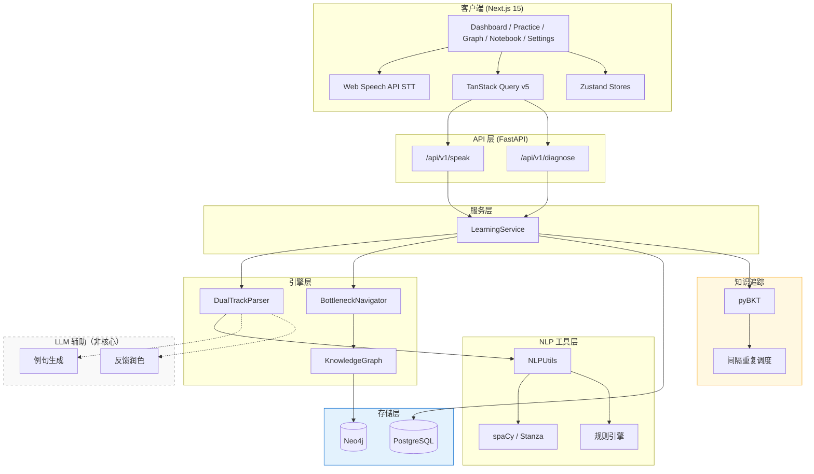

# Smart Grammar System — Agent 系统提示文档

> **用途**：本文档是 Smart Grammar System（智能英语语法学习系统）的持久化设计与实施参考。  
> Agent 在迭代开发、代码审查、架构决策时**应优先引用本文档**，确保与项目愿景和技术约束保持一致。  
> **版本**：v0.2.2 | **最后更新**：2026-06-07 | **当前阶段**：Phase 1 ✅ + 前端骨架 ✅ + Debug 审计完成  
> **审计日志**：[docs/debug_audit_log.md](./debug_audit_log.md)

---

## 目录

1. [核心理念](#1-核心理念)
2. [系统设计](#2-系统设计)
3. [系统架构](#3-系统架构)
4. [技术栈](#4-技术栈)
5. [前端架构](#5-前端架构)
6. [实施计划](#6-实施计划)
7. [Debug 审计与已知问题](#7-debug-审计与已知问题)

---

## 1. 核心理念

### 1.1 愿景（Vision）

Smart Grammar System 是一个**输出驱动型（Output-Driven）**的自适应英语语法学习系统。  
目标不是让用户「背规则、做选择题」，而是帮助用户**真正掌握并灵活运用**英语语法——能开口说、能写对、能在真实场景中迁移。

核心命题：

> **学习的终点是产出（Output），而非输入（Input）。**  
> 系统围绕用户的每一次真实表达进行诊断、追踪与路径导航。

### 1.2 创新点（Innovations）

| 创新点             | 说明                                                                                                                                           |
| ------------------ | ---------------------------------------------------------------------------------------------------------------------------------------------- |
| **非大模型内核**   | 核心诊断基于语法知识图谱 + 知识追踪算法（BKT），提供高确定性、低延迟反馈；LLM 仅作辅助（例句生成、自然语言反馈润色），**禁止**用于语法纠错判定 |
| **双轨制评价体系** | Free Mode 保护开口自信；Strict Mode 高精度应试训练；同一输入在不同模式下产生不同教学策略                                                       |
| **瓶颈逆向诊断**   | 连续失败达阈值时，沿知识图谱逆向追溯前置依赖，引导用户回到基础节点做微操练                                                                     |
| **静默错误积累**   | Free Mode 不打断用户，但后台持续记录细微语法漏洞，驱动间隔复习调度                                                                             |

### 1.3 双轨制评价体系（Dual-Track Evaluation）

#### 🚀 自由表达模式（Free Mode）

- **目标**：降低开口焦虑，建立表达自信
- **通过条件**：主谓宾核心结构正确 + 语义通顺 → `passed=True`
- **错误处理**：时态、冠词、单复数等细微漏洞写入 `silent_errors`，**不打断、不扣分**
- **适用场景**：日常口语练习、对话模拟、语音自由表达

#### 📝 严谨应试模式（Strict Mode）

- **目标**：高精度语法训练，对标考试/学术写作标准
- **检查范围**：时态、语态、冠词、介词、第三人称单数、句子结构等全量规则
- **错误呈现**：每条错误生成 `error_tags`，包含：
  - `grammar_point`：语法点标识
  - `error_type`：题型分类（如 `tense`、`article`）
  - `severity`：严重等级（`low` / `medium` / `high` / `critical`）
  - `star_level`：难度星级（1–5 星）
  - `token_span`：错误字符区间
  - `suggestion`：修正建议
- **通过条件**：无 `high` / `critical` 级错误 + 语义通顺
- **适用场景**：考前冲刺、语法专项训练、写作纠错

### 1.4 科学基础（Scientific Foundation）

| 理论/方法                                              | 在系统中的角色                                                    |
| ------------------------------------------------------ | ----------------------------------------------------------------- |
| **知识图谱（Knowledge Graph）**                        | 语法点节点 + `PREREQUISITE_OF` 依赖边；支撑路径导航与瓶颈逆向诊断 |
| **贝叶斯知识追踪（BKT, pyBKT）**                       | 追踪用户对各语法点的掌握概率 P(L)，驱动自适应出题                 |
| **间隔重复（Spaced Repetition, Ebbinghaus-inspired）** | 基于 `silent_errors` 与 BKT 状态调度复习时机                      |
| **输出驱动学习（Output-Driven Learning）**             | 以用户真实产出为输入，而非预设题库答案                            |
| **符号 NLP + 句法依存分析**                            | spaCy / Stanza 提供确定性语法结构分析，替代 LLM 黑盒判定          |

---

## 2. 系统设计

### 2.1 用户流程（User Flow）



### 2.2 模块划分（Module Division）

| 层级         | 模块                                       | 职责                                 | 当前状态                  |
| ------------ | ------------------------------------------ | ------------------------------------ | ------------------------- |
| **API 层**   | `app/main.py`                              | FastAPI 路由、请求校验、生命周期管理 | ✅ Phase 1                |
| **服务层**   | `app/services/learning_service.py`         | 业务编排：解析 → 记录 → 诊断         | ✅ Phase 1                |
| **服务层**   | `app/services/admin_service.py`            | BKT 掌握度矩阵（管理/调试）          | ✅ 骨架                   |
| **引擎层**   | `app/engine/dual_track_parser.py`          | 双轨制语法解析                       | ✅ Phase 1                |
| **引擎层**   | `app/engine/bottleneck_navigator.py`       | 瓶颈逆向诊断导航                     | ✅ Phase 1                |
| **引擎层**   | `app/engine/knowledge_graph.py`            | 语法知识图谱访问                     | ✅ Phase 1                |
| **引擎层**   | `app/engine/lexicon.py` 【新增】           | 词典与形态学引擎                     | ✅ Phase 1 (NEW)          |
| **工具层**   | `app/utils/nlp_utils.py`                   | spaCy 依存分析 + 规则引擎            | ✅ Phase 1                |
| **模型层**   | `app/models/schemas.py`                    | Pydantic 请求/响应/数据结构          | ✅ Phase 1                |
| **前端**     | `frontend/` Next.js 15                     | 仪表盘、练习、图谱、错题本、设置     | ✅ Phase 1 (含语法仪表盘) |
| **测试**     | `frontend/vitest.config.ts` + `*.test.tsx` | UI / 组件 / 页面测试                 | ✅ Phase 1                |
| **持久化**   | PostgreSQL                                 | 用户、学习记录、错题本               | ⏳ Phase 2                |
| **图谱存储** | Neo4j                                      | 语法点节点与依赖关系                 | ⏳ Phase 2                |
| **知识追踪** | pyBKT / 规则引擎                           | 掌握概率追踪与复习调度               | ⏳ Phase 3                |
| **LLM 辅助** | 例句生成 / 反馈润色                        | 非核心判定，仅辅助内容生成           | ⏳ Phase 4                |

### 2.3 数据模型（Data Models）

#### 核心解析模型

```
ParseOutputResponse
├── passed: bool
├── mode: "free" | "strict"
├── user_text: str
├── core_structure: CoreStructureResult
│   ├── has_subject / has_verb / has_object
│   ├── is_semantically_fluent
│   └── structure_score: float
├── silent_errors: list[SilentError]
├── error_tags: list[ErrorTag]
├── feedback: str
└── micro_drills: list[MicroDrill]   # Strict Mode 犯错时内联返回
```

#### 错误标签模型

```
ErrorTag
├── grammar_point: str
├── message: str
├── severity: ErrorSeverity
├── star_level: int
├── error_type: str
├── span: TokenSpan | null          # {start_char, end_char, text, token_index}
└── suggestion: str | null

TokenSpan
├── start_char: int
├── end_char: int
├── text: str
└── token_index: int | null

MicroDrill
├── drill_id / grammar_point / question
├── example_sentence / correct_answer / options
├── explanation / difficulty (1-5)
```

#### 瓶颈诊断模型

```
BottleneckDiagnosis
├── is_bottleneck: bool
├── grammar_point: str
├── consecutive_failures: int
├── failure_threshold: int
├── prerequisite_nodes: list[PrerequisiteNode]
├── recommendation: str
├── micro_drill_ids: list[str]
└── micro_drills: list[MicroDrill]   # 瓶颈触发时内联返回
```

#### API 端点契约

| 方法   | 路径                                  | 请求体            | 响应体               | 前端封装            |
| ------ | ------------------------------------- | ----------------- | -------------------- | ------------------- |
| `POST` | `/api/v1/speak`                       | `SpeakRequest`    | `SpeakResponse`      | `evaluateSpeech()`  |
| `POST` | `/api/v1/diagnose`                    | `DiagnoseRequest` | `DiagnoseResponse`   | `diagnoseBottleneck()` |
| `GET`  | `/health`                             | —                 | `{status, service}`  | `checkHealth()`     |
| `GET`  | `/api/v1/admin/bkt-status/{user_id}`  | —                 | `BKTMatrixResponse`  | `getBktStatus()`    |

#### 后端 API 数据模型

`SpeakRequest`

- `user_text: str`：用户语音转写后的文本，不能为空
- `mode: "free" | "strict"`：评价模式，默认 `free`
- `user_id: str | null`：可选用户 ID，用于学习记录与诊断关联

`SpeakResponse`

- `success: bool`
- `data: ParseOutputResponse`

`ParseOutputResponse`

- `passed: bool`
- `mode: "free" | "strict"`
- `user_text: str`
- `core_structure: CoreStructureResult`
- `silent_errors: list[SilentError]`
- `error_tags: list[ErrorTag]`
- `feedback: str`

`DiagnoseRequest`

- `user_id: str`
- `grammar_point: str`
- `consecutive_failures: int`

`DiagnoseResponse`

- `success: bool`
- `data: BottleneckDiagnosis`

`BottleneckDiagnosis`

- `is_bottleneck: bool`
- `grammar_point: str`
- `consecutive_failures: int`
- `failure_threshold: int`
- `prerequisite_nodes: list[PrerequisiteNode]`
- `recommendation: str`
- `micro_drill_ids: list[str]`

`HealthResponse`

- `status: str`
- `service: str`

### 2.4 词典与形态学引擎（Lexicon & Morphology Engine）【新增】

#### 2.4.1 设计目标

- 为语法解析提供词形变化、词根词缀、不规则形式、常见搭配等**确定性支持**
- 提升双轨解析器的精度（尤其是 Strict Mode 的细微错误检测）
- 支持**举一反三**：从一个单词扩展到其家族（derive → derivation → derivative 等）
- 为用户提供类词典式解释，增强学习深度

#### 2.4.2 核心功能

| 功能 | 说明 | 示例 |
| ---- | ---- | ---- |
| **词形还原与形态分析** | 识别不规则变化 | `went → go`、`children → child`、`running → run` |
| **词性与语法属性标注** | POS + 语法特征 | 可数/不可数、及物/不及物、单复数要求 |
| **常见搭配与用法库** | Collocation 库 | `make a decision`（✓）vs `do a decision`（✗） |
| **词根词缀家族** | 派生词支持 | `decide` → [`decision`, `indecisive`, `decisive`] |
| **与知识图谱联动** | 双向关联 | `LexicalEntry ↔ GrammarPoint` 关系 |

#### 2.4.3 数据模型

```python
class LexicalEntry(BaseModel):
    """词典条目"""
    lemma: str                              # 词根
    pos: str                                # 词性 (VERB, NOUN, ADJ...)
    inflections: dict[str, str]             # {"past": "went", "gerund": "going", ...}
    irregular: bool                         # 是否不规则变化
    grammatical_features: dict              # {"countable": True, "requires_article": True, ...}
    common_collocations: list[str]          # ["make a decision", "make progress", ...]
    word_family: list[str]                  # 派生词 ["decide", "decision", "indecisive"]
    grammar_point_ids: list[str]            # 关联的语法点 ["present_perfect", "past_simple"]
```

#### 2.4.4 在现有模块中的集成方式

##### 1. DualTrackParser（核心增强）

在 `parse_output()` 中添加词典查询步骤：

```python
# 在 DualTrackParser.__init__ 中注入
self.lexicon = get_lexicon_engine()

# 在 parse_output 方法中（新增）
def parse_output(self, user_text: str, mode: str, user_id: Optional[str] = None):
    # ... 现有 spaCy 处理
    doc = self.nlp(user_text)
    tokens = [token.lemma_ for token in doc]
    
    # 新增：词典查询
    lexical_info = self.lexicon.lookup_tokens(tokens)
    
    if mode == "strict":
        errors = self._strict_check_with_lexicon(doc, lexical_info)
    else:
        errors = self._free_check_with_lexicon(doc, lexical_info)
    
    # ... 返回结果
```

##### 2. BottleneckNavigator（诊断增强）

当检测到时态错误时，逆向追溯到相关助动词/动词形态的 `LexicalEntry`：

```python
# 示例：检测到 "have went" 错误
entry = self.lexicon.lookup("go")
# entry.inflections["past_participle"] = "gone"
# 推荐用户学习 "have + 过去分词" 规则
```

##### 3. Feedback 生成

**Free Mode**：静默记录 + 词典式小贴士

```
✓ 表达很棒！继续保持开口说英语的信心。
💡 小贴士：decide 后常接 on/upon（例如 decide on the date）
```

**Strict Mode**：详细建议 + 词形变化示例

```
✗ 错误：have went
✓ 正确：have gone
📚 解析：go 是不规则动词，过去分词是 gone（不是 went）
```

##### 4. 练习生成器

动态生成包含目标词形变化的句子练习：

```python
# 如果用户在 present_perfect 上失败
exercise = generate_exercise_with_lexicon(
    grammar_point="present_perfect",
    target_words=["go", "come", "have", "do"]
)
# 生成：I have ___ to the school. (gone)
```

---

## 3. 系统架构

### 3.1 高层架构图



### 3.2 目录结构

```
Memora_language_2026_6_7/
├── app/                                 # 后端 FastAPI
│   ├── main.py                          # speak / diagnose / health / admin/bkt-status
│   ├── engine/
│   │   ├── dual_track_parser.py         # 双轨解析 + Lexicon 集成
│   │   ├── bottleneck_navigator.py
│   │   ├── knowledge_graph.py
│   │   └── lexicon.py                   # 词典与形态学引擎
│   ├── models/schemas.py
│   ├── services/
│   │   ├── learning_service.py
│   │   └── admin_service.py             # BKT 矩阵骨架
│   └── utils/
│       ├── nlp_utils.py
│       └── logging_utils.py
├── docs/
│   ├── SmartGrammar_System_Prompt.md    # 本文档
│   └── debug_audit_log.md               # Debug 审计日志
├── frontend/
│   ├── package.json
│   ├── next.config.ts
│   ├── vitest.config.ts
│   ├── vitest.setup.ts
│   ├── src/
│   │   ├── app/
│   │   │   ├── dashboard/
│   │   │   │   ├── grammar/page.tsx
│   │   │   │   ├── layout.tsx
│   │   │   │   └── page.tsx
│   │   │   ├── graph/
│   │   │   │   └── page.tsx
│   │   │   ├── notebook/
│   │   │   │   └── page.tsx
│   │   │   ├── practice/
│   │   │   │   ├── exam/page.tsx
│   │   │   │   ├── free/page.tsx
│   │   │   │   └── talk/page.tsx
│   │   │   └── settings/
│   │   │       └── page.tsx
│   │   ├── components/
│   │   │   ├── grammar/
│   │   │   │   ├── evaluation-result.tsx
│   │   │   │   └── inline-highlight.tsx
│   │   │   ├── graph/
│   │   │   │   ├── detail-panel.tsx
│   │   │   │   └── knowledge-graph-view.tsx
│   │   │   ├── layout/
│   │   │   │   ├── app-shell.tsx
│   │   │   │   ├── header.tsx
│   │   │   │   └── sidebar.tsx
│   │   │   ├── providers/
│   │   │   │   ├── app-providers.tsx
│   │   │   │   ├── query-provider.tsx
│   │   │   │   └── theme-provider.tsx
│   │   │   └── shared/
│   │   │       └── kpi-card.tsx
│   │   ├── hooks/
│   │   │   └── useGrammarEvaluation.ts
│   │   ├── services/
│   │   │   ├── api.ts
│   │   │   └── graph-data.ts
│   │   ├── stores/
│   │   │   ├── useAudioStore.ts
│   │   │   ├── useThemeStore.ts
│   │   │   └── useUserStore.ts
│   │   ├── lib/
│   │   │   ├── utils.ts
│   │   │   └── error-span.ts            # ErrorTag span 兼容层
│   │   └── types/api.ts                 # 与 schemas.py 同步
├── requirements.txt
└── tests/                               # ⏳ 后端 pytest 待补充
```

### 3.3 关键技术决策（Technical Decisions）

| 决策         | 选择                           | 理由                                  | 约束                           |
| ------------ | ------------------------------ | ------------------------------------- | ------------------------------ |
| 语法判定引擎 | spaCy + 规则引擎               | 确定性、可解释、低延迟                | LLM 不参与核心判定             |
| Web 框架     | FastAPI                        | async 原生、Pydantic v2 集成          | —                              |
| API 代理     | Next.js rewrites               | 前端统一请求 `/api/v1/*` 代理到后端   | 环境变量 `NEXT_PUBLIC_API_URL` |
| 前端框架     | Next.js 15 + React 19          | App Router + React Server/Client 混合 | 需兼容 React 19 生态           |
| 测试框架     | Vitest + RTL                   | 轻量、本地化、React 19 支持           | 组件测试优先                   |
| 前端图谱     | @xyflow/react + @dagrejs/dagre | 知识图谱可视化与自动布局              | 目前静态图谱数据               |
| 状态管理     | Zustand + React Query          | 轻量化本地状态与服务端请求缓存        | —                              |

---

## 4. 技术栈

### 4.1 后端

| 组件        | 技术       | 版本 / 说明 |
| ----------- | ---------- | ----------- |
| 语言        | Python     | 3.11+       |
| Web 框架    | FastAPI    | >= 0.110    |
| ASGI 服务器 | Uvicorn    | >= 0.27     |
| 数据校验    | Pydantic   | v2          |
| 依存分析    | spaCy      | >= 3.7      |
| 图数据库    | Neo4j      | >= 5.14     |
| ORM         | SQLAlchemy | >= 2.0      |
| 异步驱动    | asyncpg    | >= 0.29     |

### 4.2 前端

| 组件     | 技术                  | 版本 / 说明 |
| -------- | --------------------- | ----------- |
| 框架     | Next.js               | ^15.1.0     |
| 视图库   | React                 | ^19.0.0     |
| 类型语言 | TypeScript            | ^5.7.2      |
| 样式     | Tailwind CSS          | ^4.0.0      |
| 状态管理 | Zustand               | ^5.0.2      |
| 数据请求 | @tanstack/react-query | ^5.62.8     |
| 表单     | react-hook-form       | ^7.54.2     |
| 验证     | zod                   | ^3.24.1     |
| 图谱     | @xyflow/react         | ^12.3.6     |
| 布局     | @dagrejs/dagre        | ^1.1.4      |
| 可视化   | recharts              | ^2.15.0     |
| 图标     | lucide-react          | ^0.468.0    |
| 动画     | framer-motion         | ^11.15.0    |
| 主题     | next-themes           | ^0.4.4      |

### 4.3 前端测试与开发工具

| 组件       | 技术                      | 说明    |
| ---------- | ------------------------- | ------- |
| 测试框架   | Vitest                    | ^1.0.4  |
| React 测试 | @testing-library/react    | ^14.3.1 |
| DOM 模拟   | jsdom                     | ^23.0.1 |
| React 插件 | @vitejs/plugin-react      | ^4.2.1  |
| Vite       | ^5.0.8                    |
| 断言扩展   | @testing-library/jest-dom | ^6.1.5  |

### 4.4 后端依赖

若使用本地后端调试，请在项目根目录安装：

```
fastapi>=0.110.0
uvicorn[standard]>=0.27.0
pydantic>=2.5.0
spacy>=3.7.0
neo4j>=5.14.0
sqlalchemy>=2.0.0
asyncpg>=0.29.0
```

并执行：

```bash
python -m spacy download en_core_web_sm
```

---

## 5. 前端架构

### 5.1 页面与路由

当前前端实现支持如下页面：

- `/dashboard`：学习仪表盘
- `/dashboard/grammar`：语法仪表盘（已实现）
- `/practice/free`：自由表达练习
- `/practice/exam`：严谨应试练习
- `/practice/talk`：口语练兵场
- `/graph`：知识图谱
- `/notebook`：错题本
- `/settings`：设置

### 5.2 前端核心模块

- `frontend/src/components/layout/sidebar.tsx`：主导航侧边栏
- `frontend/src/components/layout/app-shell.tsx`：应用布局容器
- `frontend/src/components/layout/header.tsx`：页面头部与主题切换
- `frontend/src/components/grammar/evaluation-result.tsx`：诊断结果卡片
- `frontend/src/components/grammar/inline-highlight.tsx`：错误高亮渲染
- `frontend/src/components/graph/knowledge-graph-view.tsx`：图谱可视化与诊断入口
- `frontend/src/components/shared/kpi-card.tsx`：KPI 展示卡片
- `frontend/src/services/api.ts`：API 请求封装
- `frontend/src/services/graph-data.ts`：当前静态图谱数据
- `frontend/src/hooks/useGrammarEvaluation.ts`：语法评价 hook
- `frontend/src/stores/useUserStore.ts`：本地用户统计与错题本存储

### 5.3 语法仪表盘实现

- 新增路由：`frontend/src/app/dashboard/grammar/page.tsx`
- 功能：
  - 语法点列表 + 掌握率进度条
  - 知识图谱可视化入口
  - 语法点说明与快速操作提示
- 与现有 `Dashboard` 页面配合，形成主视图与语法专览双入口

### 5.4 API 代理与后端交互

`frontend/next.config.ts` 中的 rewrite 将前端请求代理到后端：

- `/api/v1/:path*` → `${API_BASE}/api/v1/:path*`
- `/health` → `${API_BASE}/health`

当前 API 层封装（`frontend/src/services/api.ts`）：

| 函数 | 方法 | 路径 | UI 接入 |
|------|------|------|---------|
| `evaluateSpeech()` | POST | `/api/v1/speak` | ✅ Free / Exam |
| `diagnoseBottleneck()` | POST | `/api/v1/diagnose` | ✅ Graph / Exam |
| `checkHealth()` | GET | `/health` | ⏳ 待接入 |
| `getBktStatus()` | GET | `/api/v1/admin/bkt-status/{id}` | ⏳ 待接入 |

**前后端类型同步规则**（2026-06-07 审计后）：

- `ErrorTag.span`（非 `token_span`）为后端标准字段
- 前端 `lib/error-span.ts` 提供 `getErrorCharRange()` 兼容层
- `ParseOutputResponse` / `BottleneckDiagnosis` 均含 `micro_drills[]`
- 修改 `schemas.py` 后**必须**同步 `frontend/src/types/api.ts`

---

## 6. 实施计划

### 6.1 当前项目进度

- **已完成**：
  - FastAPI 后端基本路由与引擎模块（含 Lexicon、Admin BKT）
  - Next.js 前端骨架与主导航（12 路由）
  - `语法仪表盘` 页面与侧边栏入口实现
  - 前端测试框架（Vitest）38/38 通过，`npm run build` 通过
  - Next.js API 代理配置完成
  - 全项目 Debug 审计（`docs/debug_audit_log.md`）
  - P0 Bug 修复：DualTrackParser 词典集成运行时错误
  - 前后端类型同步：`TokenSpan`、`MicroDrill`、`getBktStatus()`

- **待推进**：
  - 后端持久化存储：PostgreSQL、Neo4j
  - BKT / 复习调度与 `silent_errors` 持久化
  - 图谱节点与诊断逻辑落盘
  - 后端自动化测试与 CI 集成
  - LLM 辅助内容生成模块

### 6.2 下阶段优先级

1. 完成后端数据持久化与 Graph DB 集成
2. 连接 BKT 状态与复习调度
3. 加强知识图谱交互与诊断反馈
4. 扩展接口测试与前端端到端覆盖
5. 优化移动端与语音体验

### 6.3 Phase 1 检查清单（后端）

- [x] DualTrackParser Free/Strict 双模式
- [x] LexiconEngine 集成至 DualTrackParser
- [x] BottleneckNavigator 逆向追溯 + micro_drills
- [x] TokenSpan / MicroDrill 数据模型
- [x] Admin BKT 状态端点（骨架）
- [x] BUG-001 修复：`self.nlp.parse()` 替代错误调用
- [ ] 后端 pytest 自动化测试

### 6.4 前端骨架检查清单

- [x] 12 路由页面可构建
- [x] Vitest 38/38 通过
- [x] API 类型与后端 schemas 同步（v0.2.2 审计后）
- [x] `getBktStatus()` API 封装
- [x] InlineHighlight 支持 `span` 字段
- [ ] `checkHealth()` UI 启动自检
- [ ] `micro_drills` UI 展示组件
- [ ] `(auth)/` 认证路由

---

## 7. Debug 审计与已知问题

> 完整记录见 [debug_audit_log.md](./debug_audit_log.md)

### 7.1 本次审计已修复

| ID | 严重度 | 问题 | 状态 |
|----|--------|------|------|
| BUG-001 | P0 | `dual_track_parser.py` 调用 `self.nlp.nlp()` 导致 API 崩溃 | ✅ 已修复 |
| DRIFT-001 | P1 | 前端 `token_span` vs 后端 `span` 字段不一致 | ✅ 已同步 |
| DRIFT-002 | P1 | 前端缺少 `micro_drills` 类型定义 | ✅ 已同步 |
| DRIFT-003 | P1 | 前端缺少 `getBktStatus()` API 封装 | ✅ 已补充 |
| WARN-001 | P2 | InlineHighlight `<p>` 嵌套 hydration 警告 | ✅ 已修复 |

### 7.2 已知技术债（待后续迭代）

| ID | 说明 | 计划阶段 |
|----|------|----------|
| WARN-003 | Sidebar `/dashboard` 与 `/dashboard/grammar` 导航同时高亮 | 前端优化 |
| WARN-004 | 错题本仅 Zustand 本地持久化，无后端同步 | Phase 2 |
| WARN-005 | 图谱数据前后端静态内存，未统一 API | Phase 2 |
| WARN-006 | spaCy 未安装时降级启发式，生产需 `en_core_web_sm` | 部署规范 |
| — | `logging_utils.py` 存在但未接入 main | Phase 2 |
| — | `micro_drills` 后端已返回，前端 UI 未展示 | Phase 2 |

### 7.3 验证命令速查

```bash
# 后端冒烟
python -c "from app.engine.dual_track_parser import DualTrackParser; p=DualTrackParser(); print(p.parse_output('He go', 'strict').error_tags[0].span)"

# 前端测试 + 构建
cd frontend && npm run test -- --run && npm run build
```

---

## 附录 A：Agent 工作约束

开发 Agent 在迭代本项目时**必须遵守**以下约束：

1. **禁止 LLM 语法判定**：`DualTrackParser` 和 `NLPUtils` 不得引入 LLM 做语法对错判定
2. **统一响应模型**：所有解析结果必须返回 `ParseOutputResponse`，不得返回裸 dict
3. **类型提示全覆盖**：新增代码必须含完整 Type Hints
4. **中文注释 + Google-style docstring**：保持与现有代码风格一致
5. **文件末尾检查清单**：新增模块须在文件末尾附自检清单
6. **最小改动原则**：每次迭代聚焦当前 Phase 任务，不超前实现后续 Phase 功能
7. **降级兼容**：spaCy / Neo4j 未配置时系统须能降级运行（开发/CI 友好）
8. **引用本文档**：架构决策、模式选择、数据结构变更须与本文档保持一致，变更时同步更新本文档
9. **前后端类型同步**：修改 `schemas.py` 时须同步 `frontend/src/types/api.ts` 与 `lib/error-span.ts`
10. **Debug 日志**：重大 Bug 修复或架构变更须更新 `docs/debug_audit_log.md`
11. **前端 API 统一入口**：所有后端请求须经 `frontend/src/services/api.ts`

---

## 附录 B：关键配置参考

```python
# 瓶颈诊断阈值
BottleneckNavigator.DEFAULT_FAILURE_THRESHOLD = 3
BottleneckNavigator.DEFAULT_MAX_DEPTH = 3

# Free Mode 结构评分阈值
DualTrackParser.free_mode_structure_threshold = 0.6

# spaCy 模型
NLPUtils.DEFAULT_SPACY_MODEL = "en_core_web_sm"
```

---

## 附录 C：快速启动

### 后端（FastAPI）

```bash
pip install -r requirements.txt
python -m spacy download en_core_web_sm
uvicorn app.main:app --reload --port 8000
# http://localhost:8000/docs
```

### 前端（Next.js）

```bash
cd frontend
npm install
cp .env.local.example .env.local
npm run dev
# http://localhost:3000 → /dashboard
```

### 全栈联调 + 自检

```bash
# 终端 A
uvicorn app.main:app --reload --port 8000

# 终端 B
cd frontend && npm run dev

# 终端 C（可选验证）
cd frontend && npm run test -- --run
```

---

*本文档随项目迭代持续更新。重大变更请同步 [debug_audit_log.md](./debug_audit_log.md)。*
